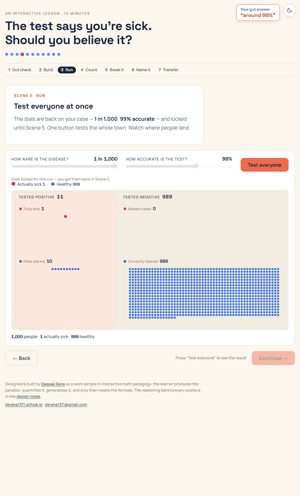
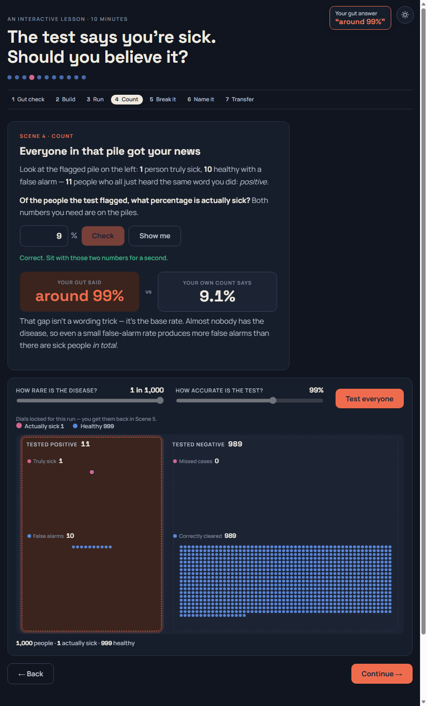
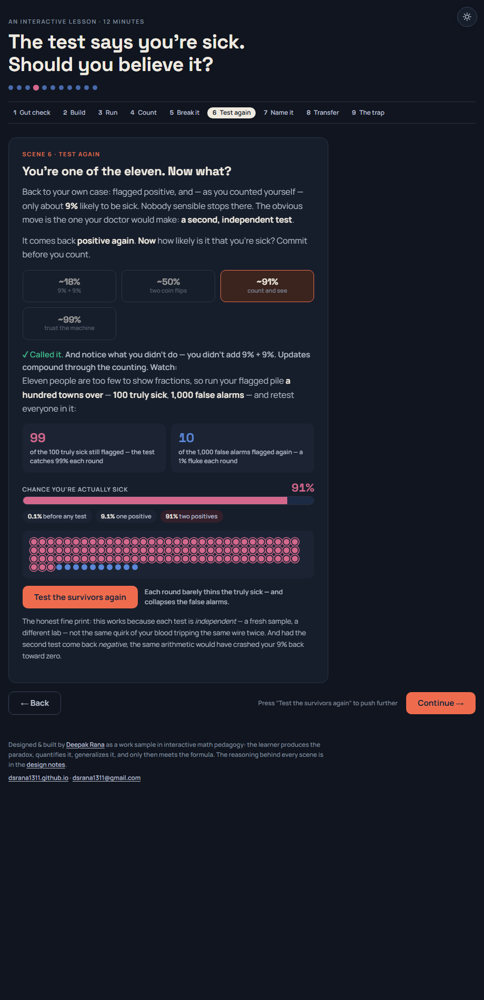

# The Medical Test Paradox

**An interactive lesson on Bayes' theorem — built as a work sample in interactive math pedagogy.**

▶ **[Play the lesson](https://dsrana1311.github.io/medical-test-paradox/)** · 📐 **[Read the design notes](https://dsrana1311.github.io/medical-test-paradox/design-notes.html)**

A disease affects 1 in 1,000 people. The test for it is 99% accurate. Yours comes back positive — how likely are you actually sick? Most people say ~90–99%. In the classic studies, most *physicians* say ~90%. The real answer is about **9%**.

This lesson never explains that. It makes you lock in an answer (the right one is on the list — almost nobody picks it), then hands you a town of 1,000 people, two dials, and a test button — and lets you disprove yourself with your own counting. The formula appears exactly once, near the end, and you build it yourself: an empty fraction, your own piles as draggable pieces, and a toggle that turns your counts into symbols.

## The design in one paragraph

**The learner produces the paradox, quantifies it, generalizes it — and only then meets the formula.** Nine scenes: lock in a gut answer (no feedback), build the population, run the test and watch it sort, compute the posterior from two on-screen numbers, break the test at different rarities, discover what a *second* positive test does (a belief meter compounds 0.1% → 9% → 91% → 99.9% as you keep retesting), assemble Bayes' theorem by dragging your own piles into an empty fraction, transfer the intuition to a face-recognition scenario — predict, count the alert pile before it exists, then watch a 50,000-face scan produce it — and close on the Bayesian trap: why updating is only as good as the evidence you go generate. Every scene is a single screen, evidence beside the question, and either extracts a commitment, hands over a control, or asks for a computation the learner can already do. The full scene-by-scene rationale is in the **[design notes](design-notes.html)**.

## Craft

- **One self-contained HTML file** — no frameworks, no build step, no network requests (fonts inlined). Double-click it and it runs.
- **Full-viewport slide layout** — each scene fits one laptop screen, narrative on the left, evidence on the right, so the numbers the learner needs are never scrolled out of view.
- **1,000-person canvas simulation** with deterministic, seeded sorting — expected values instead of random draws, so the arithmetic the learner is asked to do always comes out clean — plus a 50,000-face stadium scan rendered from an offscreen canvas.
- **Every dot is inspectable** — hover names each person and their outcome ("healthy, flagged — false alarm").
- **Progress is gated by doing, not scrolling** — you can't reach the arithmetic without running the experiment.
- **Accessible**: colorblind-validated palette with non-color backup encoding, light + dark themes, reduced-motion honored, screen-reader announcements of results, keyboard operable.
- **Play-tested on real learners** — every iteration traces to observed behavior (freezes, guess-loops, disbelief at the false-alarm count), not hunches. The changes are documented with annotated screenshots in the [design notes](design-notes.html#learner-testing).

## Run locally

Open `index.html` in any browser. That's it.

## Provenance

The medical scenario is the classic Eddy/Gigerenzer physician problem. The epilogue's "Bayesian trap" framing is popularized by Veritasium's [*The Bayesian Trap*](https://www.youtube.com/watch?v=R13BD8qKeTg). All numbers in the lesson are deterministic expected values, chosen so every division the learner is asked to do comes out clean — the math is verified scene by scene in the design notes.

## Author

**Deepak Rana** · [dsrana1311.github.io](https://dsrana1311.github.io/) · [dsrana1311@gmail.com](mailto:dsrana1311@gmail.com)
